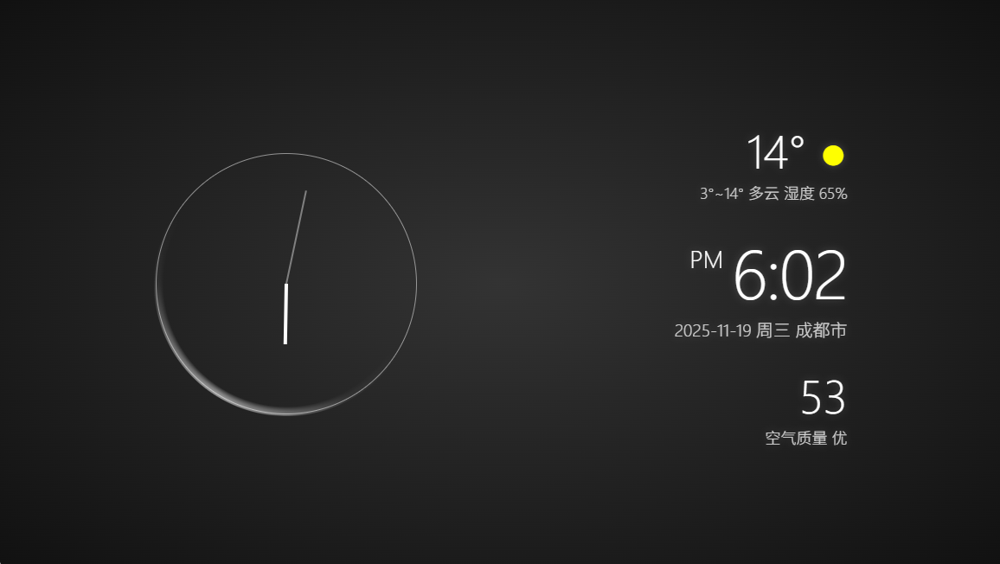

# xiaomitv_clock_screensaver
小米电视时钟屏保，HTML实现（全部由AI编写）。

## 预览截图

## 在线预览
通过 HTMLPreview 在线查看：
https://htmlpreview.github.io/?https://raw.githubusercontent.com/withsalt/xiaomitv_clock_screensaver/refs/heads/main/index.html

## 功能简介
- 显示当前时间、日期与所在城市（根据访问IP地址定位）。
- 展示天气与空气质量信息。
- 自适应布局，适配电视与桌面浏览器。

## 说明
- 可直接用浏览器打开 `index.html`。
- 天气与空气质量数据来自第三方接口，默认密钥已写入示例，仅用于演示。
- 如需长期稳定使用，请更换为自己的密钥或代理服务。

## 许可证
见 `LICENSE` 文件。设计归Xiaomi所有。
